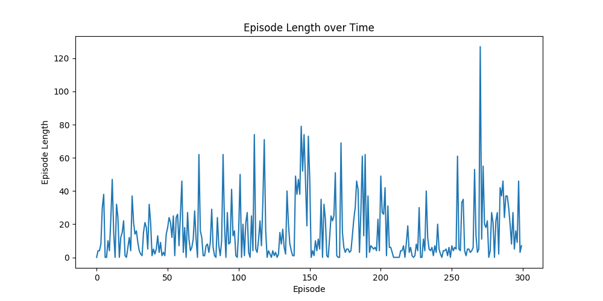
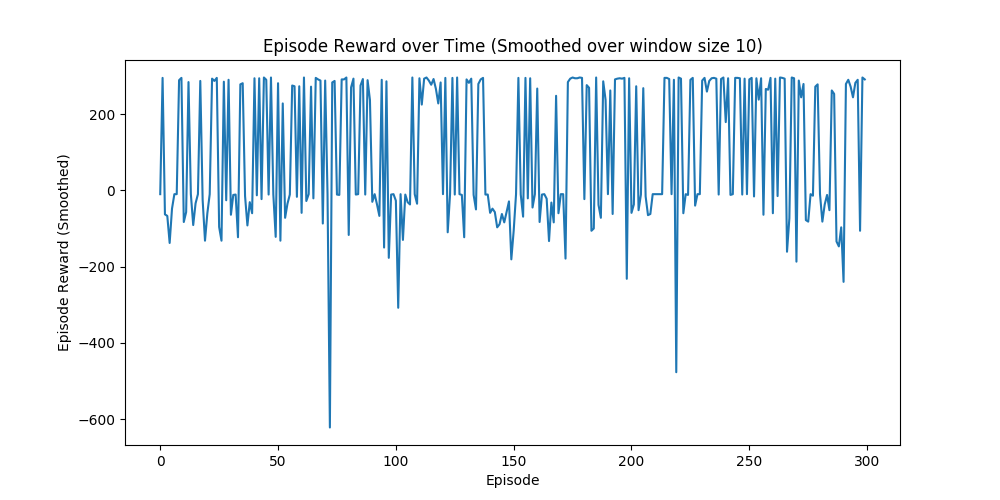

# 逃生游戏

## 任务描述

基于malmo的强化学习任务：一个agent被困在封闭的屋子里，屋子内某处失火，并且火势会传播，agent需要迅速找到逃跑路线从而逃生。（本任务中，若agent找到绿色水晶block，即视为逃生成功）

## 任务准备

需要先生成一系列Maze.xml文件，即生成不同的地图，供AI训练。每一张地图中包括：火源、地面、障碍物（可阻断火）、终点。

地面被设置为可传播火并且不会熄灭；生成障碍物能够让火势顺着预期的大致方向蔓延，而不是在房间中随意传播。

## 训练方法

本实验依然采用DQN算法以及$\epsilon-greedy$策略来训练。

DQN中的基本贝尔曼等式如下：
$$
Q(s,a)=r+\gamma\times max_{a'}Q(s',a')
$$
在本任务中，不同符号的意义如下：

- s：当前状态。包括房间不同位置的信息，以及agent所处位置的信息。
- s'：s采取动作a后的下一个状态
- a：agent当前会采取的动作。可选取的动作为：前、后、左、右移动（即不能使用任何物品栏的东西，也不能与房间的任何物品产生交互）
- a‘：未来状态将采取的动作。
- r：采取动作后的奖励值
- gamma：超参数。

**$\epsilon-greedy$策略：**

本实验中，我们使用epsilon-greedy来采取动作。其中随机采取动作的概率为$\epsilon$，采取最优动作的概率为$1-\epsilon$。随着实验迭代过程，$\epsilon$将从1均匀减少到0.1。

**DQN网络：**

采用3个卷积层和2个全连接层。

```python
# 网络架构
conv1 = (32, 8, 4)
relu
conv2 = (64, 4, 2)
relu
conv3 = (64, 3, 1)
relu
fc1 = (flattened(conv3), 512)
fc2 = (fc1, len(actionSet))
```

使用经验池方法，以及两个独立网络：Q-net和target-net

- 经验池：存储每一次采样轨迹（state, action, reward, next_state, done），每次agent采样的轨迹会被存储其中，每一次从中取出batch_size=32供训练。
  - trick：先随机探索采样，将经验池填充到10%。之后再根据经验池训练并选取动作。
- 采用两个独立网络，target-net用来计算loss和更新参数。loss采用均方误差

$$
L=\frac{1}{2}[r+max_{a'}Q(s',a')-Q(s,a)]^2\\
target=r+max_{a'}Q(s',a')\\
prediction=Q(s,a)
$$

**过拟合现象：**

经实验，因为地图及任务较为简单，对地图的选择会对agent的表现产生很大影响。

为防止在某一张地图中的过拟合，每过20个episode会随机更新一张地图。这样处理可以有效防止过拟合，帮助agent提升在未知地图的表现，但同时也增加了训练的时间。

**reward值设定：**

- 成功逃生（到达emerald_block），reward = 100
- 碰到火，reward = -50
- 碰到障碍物，reward = -2
- 移动一次，reward = -1（鼓励少移动）
- 死亡，reward = -10
- 超时，reward = -5

以上reward值均在`get_multiple_mazes.py`中，在地图的xml文件中定义。


## 实验结果与分析

为了让agent尽快的完成逃生，我们希望在每一个episode中，agent采取的动作越少越好，获得的奖励值reward越多越好，并且不能走到火势中。因此，理想中agent在每个episode采取的动作数量，应该随着训练过程逐渐减少，获得的reward逐渐增大，计算出的loss逐渐减小。

在采用上述网络结构与算法，定义相关reward后，经过300个epoch训练，得到以下数据：



- episode length表示在每次游戏时agent采取的动作数量。该图表现了在300个epoch训练后，可看出整体的趋势是逐渐减小。



- episode reward表示在每次游戏时agent获得的reward值。相关reward定义已在本文档上方给出。从该图中可以看出reward值逐渐在200处以上趋于稳定，并且reward值与当次采取的动作数量（episode length）有关，episode length较小的地方，对应reward较大，反之length较大的地方，对应的reward较小。

总体上该DQN方法非常有效，且在测试中，agent面对不同的地图表现均较好，*但300-500次训练后仍不能保证一定能找到逃生点*。并且经过300-500次的训练（每次训练在docker的cpu上需要花费2小时左右），模型整体的变化其实并不显著，需要1000次以上的训练才能到达相对较好的效果，但限于docker实验环境的限制，难以花费大量时间训练训练1000次以上来调整此模型，并且经初步实验，模型在所给定的某些地图上很可能出现过拟合（当面对相同的地图，agent总会采取相同的行动，导致进入火圈，任务失败）。

## 思考与展望

针对“逃生游戏”这样较为简单的任务，DQN方法在面对环境时表现的性能并不一定优于Q-learning或动态规划方法，反而会消耗大量时间和资源来进行网络的训练，且经过数百次迭代后模型性能提升并不显著。但另一方面，DQN方法的可移植性更好，在面对更大规模或更加复杂的环境时，我们能够简单的修改DQN模型即可重新训练和保存模型。

面对上述矛盾，我们需要针对特定任务，对DQN算法进行特定的优化，例如：不鼓励走回头路（如果agent将要走的路在之前已走过，那么会得到一个负的reward值），根据起始的火源位置来先进行初步的路线探测（不使用DQN网络）等。

如果条件允许，我们希望能够把在5x5的地图上训练的模型移植到7x7，或10x10的环境中，在GPU上训练，这样能够有效避免过拟合现象，并且能提升agent表现的泛化性。与此同时，在更加复杂的环境中也需要设计相对更复杂的网络（例如更多的卷积层）来进行训练，这也对docker实验环境的性能提出了更高的要求。


